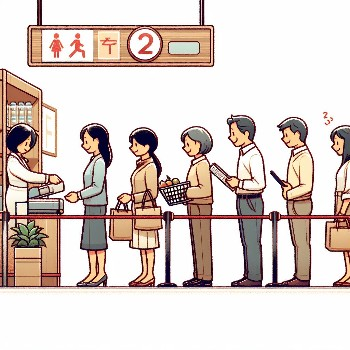
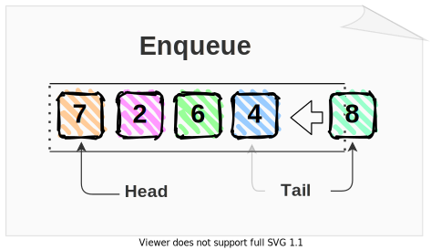
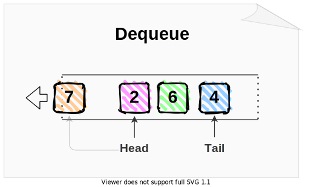
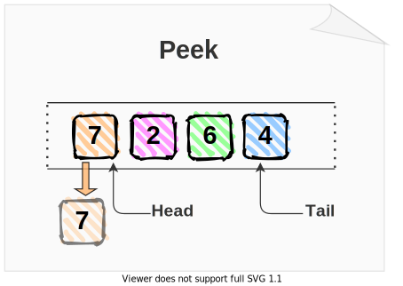
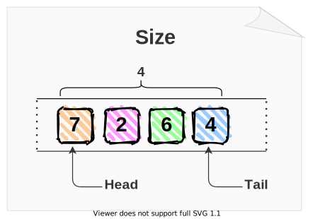

# Queue

A queue is a linear data structure that performs operations in a particular order: **First In, First Out (FIFO)**.  
Queues are used when things don’t have to be processed immediately, but in a First In First Out manner, maintaining the order of elements. This is analogous to a real-life queue, such as a line at a grocery store checkout, where the person who comes in first is served first.



## Purpose of Queue Data Structure

Queues are fundamental in simulations, task scheduling systems, and when implementing breadth-first search algorithms. The primary purpose is to ensure that data is processed in the order it was received.

A common mistake is not checking if the queue is empty before dequeuing, which leads to errors. Another is inefficiently using a list, where enqueueing becomes O(n) due to the insertion operation at the beginning of the list.

## Basic Operations

### Enqueue

Add a "value" to the back the queue. The performance of adding to the end of the dynamic array is **O(1)**.



Python code implementation:

```python
def enqueue(self, item):
    self.items.append(item)
```

Python code example:

```python
queue = Queue()
queue.enqueue("apple")
print(queue.items) # Output: ["apple"]
queue.enqueue("orange")
print(queue.items) # Output: ["apple", "orange"]
```

### Dequeue

Removes and returns the item from the front of the queue. The performance of obtaining and removing from the beginning of the dynamic array is **O(n)**.



Python code implementation:

```python
def dequeue(self):
    return self.items.pop(0)
```

Python code example:

```python
queue = Queue()
queue.enqueue("apple")
queue.enqueue("orange")
print(queue.items)  # Output: ["apple", "orange"]
item = queue.dequeue()
print(item) # Output: "apple"
print(queue.items)  # Output: ["orange"]
```

### Peek

Get the item at the front of the queue without removing it. The performance of obtaining the first element of the dynamic array is **O(1)**.



Python code implementation:

```python
def peek(self):
    if not self.is_empty():
        return self.items[0]
```

Python code example:

```python
queue = Queue()
queue.enqueue("banana")
queue.enqueue("cherry")
print(queue.peek()) # Output: "banana"
```

### Size

Returns the numbers of items in the queue. The performance of returning the size of the dynamic array is **O(1)**.



Python code implementation:

```python
def size(self):
    return len(self.items)
```

Python code example:

```python
queue = Queue()
queue.enqueue("banana")
queue.enqueue("cherry")
print(queue.size()) # Output: 2
```

### Is empty

Checks if the queue is empty. The performance of checking the size of the dynamic array is **O(1)**.

Python code implementation:

```python
def is_empty(self):
    return self.items == []
```

Python code example:

```python
queue = Queue()
print(queue.is_empty()) # Output: True
queue.enqueue("banana")
queue.enqueue("cherry")
print(queue.is_empty()) # Output: False
```

## Implementation in Python

As we said before, the best way to implement queues in python is using collections. For the purposes of this tutorial and to clarify the implementation we are going to use list.

Here is our implementation of a queue using Python's list:

```python
class Queue:
    def __init__(self):
        self.items = []

    def enqueue(self, item):
        self.items.append(item)

    def dequeue(self):
        return self.items.pop(0)

    def peek(self):
        if not self.is_empty():
            return self.items[0]

    def size(self):
        return len(self.items)

    def is_empty(self):
        return self.items == []
```

## Example: Customer Support System

Imagine we're developing software for an electronic store that needs to manage its online customer support system. Customers submit support tickets that the first available support agent handles. This system should prioritize customer tickets on a first-come, first-serve basis. When a new ticket comes in, it is added to the queue; when an agent is available, they take the next ticket from the queue. We will use a queue to manage this process.

```python
class SupportTicketQueue(Queue): # Inherits from our Queue class.
    def process_tickets(self):
        while not self.is_empty():
            ticket = self.dequeue()

            # Simulate ticket processing.
            self.handle_ticket(ticket)

    def handle_ticket(self, ticket):
        print(f"Processing ticket #{ticket}")

        print("Ticket resolved.\n")

# Example usage.
support_queue = SupportTicketQueue()
support_queue.enqueue(1)
support_queue.enqueue(2)
support_queue.enqueue(3)
support_queue.process_tickets()
```

Expected Output:

```
Processing ticket #1:
Ticket resolved.

Processing ticket #2:
Ticket resolved.

Processing ticket #3:
Ticket resolved.
```

You can get the code here: [Customer Support System](../scripts/queue/support_system.py)

## Problem to Solve: Cafeteria System

Your task is to simulate a cafeteria system where orders are placed online and need to be served in the order they were received. Implement a `CafeteriaOrderQueue` using the `Queue` class. Add functions to place an order, serve and order, and check what the next order is.

Here is what you need to consider:

1. `place_order(order_id)`: Accepts an "order_id" and places it in the queue.
2. `serve_order()`: Serves the next order in the queue.
3. `next_order()`: Peeks at the next order to be served without serving it.
4. Your implementation should also handle the scenario when there are no orders to server.

Here is an example of what output might look like when the implemented system is run:

```
Next order to serve: 1
Order #1 served.

Next order to serve: 2
Order #2 served.

No more orders to serve.
```

You can check your code with the solution here: [Solution]()

[Back to the Welcome Page](../README.md)
