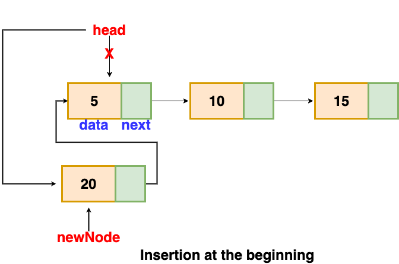
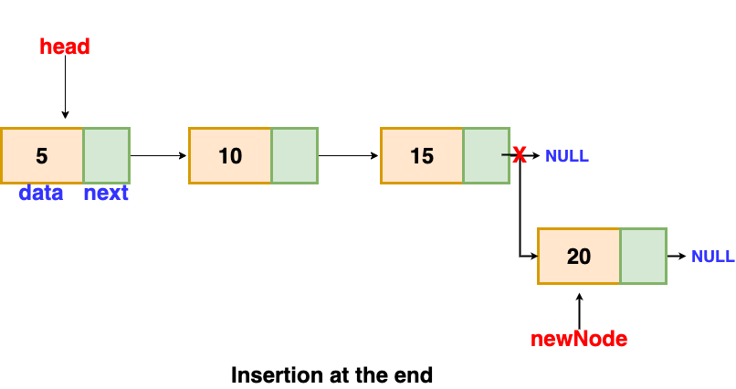
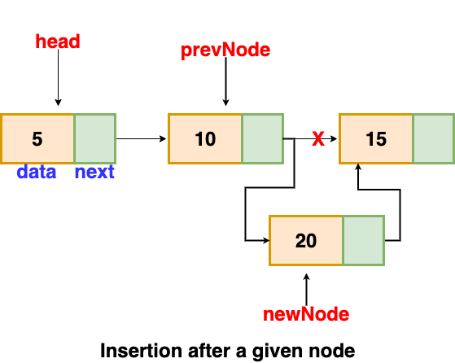
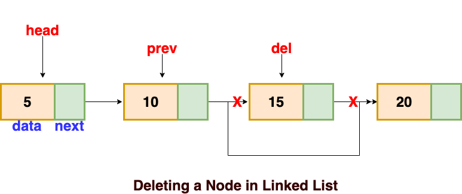
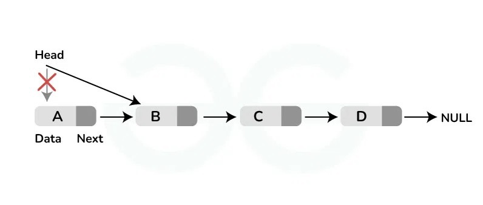
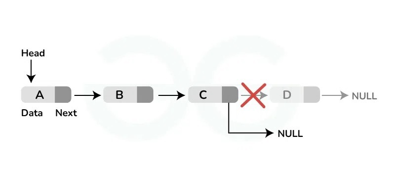

# Linked Lists

A Linked List is a linear collection of elements called **nodes**, and each node contains a value and a **pointer** to the next node in the sequence and the previous one. Unlike arrays, linked lists are not contiguous in memory, allowing for efficient insertion and deletion of elements without reorganizing the entire data structure. A real-life analogy for a linked list data structure can be a treasure hunt where each clue leads to the next location where the next clue can be found. In this analogy, each "clue" represents a node in the linked list, which contains both the information needed for the current step of the hunt (analogous to the data stored in a node) and a pointer or direction to the next clue's location (similar to the pointer in each node of a linked list that points to the next node).


## Purpose of the Data Structure

Linked lists are ideal for applications where the data is dynamically sized and constant-time insertions or deletions from the list are needed, such as implementing queues, stacks, or even more complex data structures like graphs.

## Basic Operations

### Insert head

Add a "value" to the beginning of the linked list. The performance of this operation is **O(1)**.



Python code implementation:

```python
def insert_head(self, value):

    # Create a new node.
    new_node = LinkedList.Node(value)

    # Check if the head is empty.
    if self.head is None:

        # Set the head to the new node.
        self.head = new_node

        # Set the tail to the new node.
        self.tail = new_node
    else:

        # Set the new node's pointer to the current head.
        new_node.next = self.head

        # Set the current head's previous pointer to the new node.
        self.head.prev = new_node

        # Set the head to the new node.
        self.head = new_node

    # Increment the length.
    self.length += 1
```

Python code example:

```python
linked_list = LinkedList()
linked_list.insert_head(15)
linked_list.insert_head(10)
linked_list.insert_head(5)
print(linked_list)  # LinkedList: [5, 10, 15]
linked_list.insert_head(20)
print(linked_list)  # LinkedList: [20, 5, 10, 15]
```

### Insert tail

Add a "value" to the end of the linked list. The performance of this operation is **O(1)**.



Python code implementation:

```python
def insert_tail(self, value):

    # Create a new node.
    new_node = LinkedList.Node(value)

    # Check if the head is empty.
    if self.head is None:

        # Set the head to the new node.
        self.head = new_node

        # Set the tail to the new node.
        self.tail = new_node
    else:

        # Set the current tail's next pointer to the new node.
        self.tail.next = new_node

        # Set the new node's previous pointer to the current tail.
        new_node.prev = self.tail

        # Set the tail to the new node.
        self.tail = new_node

    # Increment the length.
    self.length += 1
```

Python code example:

```python
linked_list = LinkedList()
linked_list.insert_head(15)
linked_list.insert_head(10)
linked_list.insert_head(5)
print(linked_list)  # LinkedList: [5, 10, 15]
linked_list.insert_tail(20)
print(linked_list)  # LinkedList: [5, 10, 15, 20]
```

## Insert after

Inserts a "value" after a given node. The performance of this operation is **O(1)**.



Python code implementation:

```python
def insert_after(self, value, new_value):

    # Get the current head node.
    curr = self.head

    # Iterate through the linked list.
    while curr is not None:

        # Check if the current node's data is equal to the value.
        if curr.data == value:

            # Check if the current node is the tail.
            if curr == self.tail:

                # Insert the new value at the tail.
                self.insert_tail(new_value)
            else:

                # Create a new node.
                new_node = LinkedList.Node(new_value)

                # Set the new node's previous pointer to the current node.
                new_node.prev = curr

                # Set the new node's next pointer to the current node's next node.
                new_node.next = curr.next

                # Set the current node's next node's previous pointer to the new node.
                curr.next.prev = new_node

                # Set the current node's next pointer to the new node.
                curr.next = new_node

            return

        # Move to the next node.
        curr = curr.next

    # Increment the length.
    self.length += 1
```

Python code example:

```python
linked_list = LinkedList()
linked_list.insert_head(15)
linked_list.insert_head(10)
linked_list.insert_head(5)
print(linked_list)  # LinkedList: [5, 10, 15]
linked_list.insert_after(10, 20)
print(linked_list)  # LinkedList: [5, 10, 20, 15]
```

## Remove

Remove the node with the specified "value". The performance of this operation is **O(n)** because we need to use a loop to find the given node.



Python code implementation:

```python
def remove(self, value):

    # Get the current head node.
    current = self.head

    # Iterate through the linked list.
    while current is not None:

        # Check if the current node's data is equal to the value.
        if current.data == value:

            # Check if the current node is the head.
            if current == self.head:

                # Remove the head.
                self.remove_head()

            # Check if the current node is the tail.
            elif current == self.tail:

                # Remove the tail.
                self.remove_tail()
            else:

                # Set the current node's previous node's next pointer to the current node's next node.
                current.prev.next = current.next

                # Set the current node's next node's previous pointer to the current node's previous node.
                current.next.prev = current.prev
            return

        # Move to the next node.
        current = current.next

    # Decrement the length.
    self.length -= 1
```

Python code example:

```python
linked_list = LinkedList()
linked_list.insert_head(20)
linked_list.insert_head(15)
linked_list.insert_head(10)
linked_list.insert_head(5)
print(linked_list)  # LinkedList: [5, 10, 15, 20]
linked_list.remove(15)
print(linked_list)  # LinkedList: [5, 10, 20]
```

## Remove head

Remove the first item from the linked list. The performance of this operation is **O(1)**.



Python code implementation:

```python
def remove_head(self):

    # Check if the head is the tail.
    if self.head == self.tail:

        # Set the head to None.
        self.head = None

        # Set the tail to None.
        self.tail = None

    # Check if the head is not None.
    elif self.head is not None:

        # Set the head's next node's previous pointer to None.
        self.head.next.prev = None

        # Set the head to the head's next node.
        self.head = self.head.next

    # Decrement the length.
    self.length -= 1

```

Python code example:

```python
linked_list = LinkedList()
linked_list.insert_head("D")
linked_list.insert_head("C")
linked_list.insert_head("B")
linked_list.insert_head("A")
print(linked_list)  # LinkedList: ["A", "B", "C", "D"]
linked_list.remove_head()
print(linked_list)  # LinkedList: ["B", "C", "D"]
```

## Remove tail

Remove the las node from the linked list. The performance of this operation is **O(1)**.



Python code implementation:

```python
def remove_tail(self):

    # Check if the head is the tail.
    if self.head == self.tail:

        # Set the head to None.
        self.head = None

        # Set the tail to None.
        self.tail = None

    # Check if the head is not None.
    elif self.head is not None:

        # Set the tail's previous node's next pointer to None.
        self.tail.prev.next = None

        # Set the tail to the tail's previous node.
        self.tail = self.tail.prev

    # Decrement the length.
    self.length -= 1
```

Python code example:

```python
linked_list = LinkedList()
linked_list.insert_head("D")
linked_list.insert_head("C")
linked_list.insert_head("B")
linked_list.insert_head("A")
print(linked_list)  # LinkedList: ["A", "B", "C", "D"]
linked_list.remove_tail()
print(linked_list)  # LinkedList: ["A", "B", "C"]
```

## Size

Returns the number of items in the linked list. The performance of this operation is **O(1)**.

Python code implementation:

```python
def size(self):
    return self.length
```

Python code example:

```python
linked_list = LinkedList()
linked_list.insert_head("D")
linked_list.insert_head("C")
linked_list.insert_head("B")
linked_list.insert_head("A")
print(linked_list.size())  # Output: 4
```

## Is empty

Returns `True` if the list is empty. The performance of this operation is **O(1)**.

Python code implementation:

```python
def is_empty(self):
    return self.size() == 0
```

Python code example:

```python
linked_list = LinkedList()
print(linked_list.is_empty())  # Output: True
linked_list.insert_head("A")
print(linked_list.is_empty())  # Output: False
```

## Implementation in Python

Here's our full implementation of a linked list in Python:

```python
class LinkedList:
    class Node:
        def __init__(self, data):
            self.data = data
            self.next = None
            self.prev = None

    def __init__(self):
        self.head = None
        self.tail = None
        self.length = 0

    def insert_head(self, value):

        # Create a new node.
        new_node = LinkedList.Node(value)

        # Check if the head is empty.
        if self.head is None:

            # Set the head to the new node.
            self.head = new_node

            # Set the tail to the new node.
            self.tail = new_node
        else:

            # Set the new node's pointer to the current head.
            new_node.next = self.head

            # Set the current head's previous pointer to the new node.
            self.head.prev = new_node

            # Set the head to the new node.
            self.head = new_node

        # Increment the length.
        self.length += 1

    def insert_tail(self, value):

        # Create a new node.
        new_node = LinkedList.Node(value)

        # Check if the head is empty.
        if self.head is None:

            # Set the head to the new node.
            self.head = new_node

            # Set the tail to the new node.
            self.tail = new_node
        else:

            # Set the current tail's next pointer to the new node.
            self.tail.next = new_node

            # Set the new node's previous pointer to the current tail.
            new_node.prev = self.tail

            # Set the tail to the new node.
            self.tail = new_node

        # Increment the length.
        self.length += 1

    def insert_after(self, value, new_value):

        # Get the current head node.
        curr = self.head

        # Iterate through the linked list.
        while curr is not None:

            # Check if the current node's data is equal to the value.
            if curr.data == value:

                # Check if the current node is the tail.
                if curr == self.tail:

                    # Insert the new value at the tail.
                    self.insert_tail(new_value)
                else:

                    # Create a new node.
                    new_node = LinkedList.Node(new_value)

                    # Set the new node's previous pointer to the current node.
                    new_node.prev = curr

                    # Set the new node's next pointer to the current node's next node.
                    new_node.next = curr.next

                    # Set the current node's next node's previous pointer to the new node.
                    curr.next.prev = new_node

                    # Set the current node's next pointer to the new node.
                    curr.next = new_node

                return

            # Move to the next node.
            curr = curr.next

        # Increment the length.
        self.length += 1

    def remove(self, value):

        # Get the current head node.
        current = self.head

        # Iterate through the linked list.
        while current is not None:

            # Check if the current node's data is equal to the value.
            if current.data == value:

                # Check if the current node is the head.
                if current == self.head:

                    # Remove the head.
                    self.remove_head()

                # Check if the current node is the tail.
                elif current == self.tail:

                    # Remove the tail.
                    self.remove_tail()
                else:

                    # Set the current node's previous node's next pointer to the current node's next node.
                    current.prev.next = current.next

                    # Set the current node's next node's previous pointer to the current node's previous node.
                    current.next.prev = current.prev
                return

            # Move to the next node.
            current = current.next

        # Decrement the length.
        self.length -= 1

    def remove_head(self):

        # Check if the head is the tail.
        if self.head == self.tail:

            # Set the head to None.
            self.head = None

            # Set the tail to None.
            self.tail = None

        # Check if the head is not None.
        elif self.head is not None:

            # Set the head's next node's previous pointer to None.
            self.head.next.prev = None

            # Set the head to the head's next node.
            self.head = self.head.next

        # Decrement the length.
        self.length -= 1

    def remove_tail(self):

        # Check if the head is the tail.
        if self.head == self.tail:

            # Set the head to None.
            self.head = None

            # Set the tail to None.
            self.tail = None

        # Check if the head is not None.
        elif self.head is not None:

            # Set the tail's previous node's next pointer to None.
            self.tail.prev.next = None

            # Set the tail to the tail's previous node.
            self.tail = self.tail.prev

        # Decrement the length.
        self.length -= 1

    def size(self):
        return self.length

    def is_empty(self):
        return self.size() == 0

    def __str__(self):

        # Create a list to store the linked list's data.
        data = []

        # Get the current head node.
        current = self.head

        # Iterate through the linked list.
        while current is not None:

            # Append the current node's data to the list.
            data.append(current.data)

            # Move to the next node.
            current = current.next

        # Return the linked list's data.
        return f"LinkedList: {data}"
```

## Example: Music Playlist Management

Let's say we have a music app that keeps a playlist. We need to be able to dynamically add songs to the playlist, play songs, move to the next song and show the full playlist.

```python
from linked_list import LinkedList


class Playlist(LinkedList):
    def __init__(self):
        super().__init__()

    def add_song(self, song):
        self.insert_tail(song)

    def play_song(self):
        if self.head is not None:
            print(f"Playing {self.head.data}")
            self.remove_head()
        else:
            print("No songs in the playlist.")

    def skip_song(self):
        if self.head is not None and self.head.next is not None:
            print(f"Skipping {self.head.data}")
            self.remove_head()
        else:
            print("No songs in the playlist.")

    def show_playlist(self):
        songs = []
        curr = self.head
        while curr is not None:
            songs.append(curr.data)
            curr = curr.next
        return " -> ".join(songs)


# Example usage.
my_playlist = Playlist()
my_playlist.add_song("Song 1")
my_playlist.add_song("Song 2")
my_playlist.add_song("Song 3")

print(f"\nPlaylist: {my_playlist.show_playlist()}")
print("Now playing: ")
my_playlist.play_song()

print(f"\nPlaylist: {my_playlist.show_playlist()}")
print("Skipping >> ")
my_playlist.skip_song()

print(f"\nPlaylist: {my_playlist.show_playlist()}")
```

Expected Output:

```
Playlist: Song 1 -> Song 2 -> Song 3
Now playing:
Playing Song 1

Playlist: Song 2 -> Song 3
Skipping >>
Skipping Song 2

Playlist: Song 3
```

You can get the code here: [Playlist Management](../scripts/linked-list/playlist_management.py)

## Problem to solve: Book Reading Tracker

Imagine you're creating a system for a reading application that keeps track of the user's reading progress through a series of books. You'll need to implement a `ReadingTracker` class using the `LinkedList` class. This tracker will manage the books the user plans to read in a specific order.

Here is what you need to consider:

1. `add_book(title)`: Adds a new book with the given "title" to the reading list.
2. `complete_book()`: Marks teh current book at the head of the list as read and removes it form the reading list.
3. `show_next_book()`: Displays the next book to be read without marking it as read.
4. `show_reading_list()`: Outputs the titles of all the books currently in the reading list in order.
5. Your implementation should handle the case when the reading list is empty appropriately.

Here is an example of what output might look like when the implemented system is run:

```
Reading List: Pride and Prejudice -> The Great Gatsby -> 1984
Next book to read: Pride and Prejudice
Reading Pride and Prejudice

Reading List: The Great Gatsby -> 1984
Next book to read: The Great Gatsby
Reading The Great Gatsby

Reading List: 1984
Next book to read: 1984
Reading 1984
No books in the reading list.
```

You can check your code with the solution here: [Solution](../scripts/linked-list/reading_tracker.py)

[Back to the Welcome Page](../README.md)
