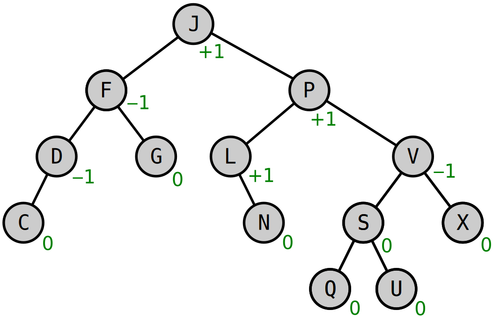

# Tree

A tree is a non-linear data structure composed of nodes connected by edges, organizing data hierarchically. The starting point is called the root, and each node contains a value and links to other nodes, which are called its children. The node linking to a child is referred to as the parent. Nodes with no children are called leaves.

## Key Terms

-   **Root**: The topmost node of the tree.
-   **Child**: A node directly connected to another node moving away from the Root.
-   **Parent**: The converse notion of a child.
-   **Leaf**: A node that does not have any children.
-   **Depth**: The length of the path from the root to the node.
-   **Height**: The length of the path from the node to the deepest leaf.


## Types of Trees

-   **Binary Tree**: A tree where each node has up to two children.


-   **Binary Search Tree (BST)**: A binary tree where the left child's value is less than its parent and the right child's value is greater.


-   **AVL Tree**: A self-balancing BST where the heights of two child subtrees of any node differ by no more than one.



## BST Basic Operations

### Insertion

Adds a new node to the tree while maintaining the specific tree properties, such as the Binary Search Tree (BST) order. The performance of this operation is **O(log _n_)**, where _n_ is the number of nodes.


Python code implementation:

```python
def insert(self, key):

    # If the tree is empty, create the root node.
    if self.root is None:
        self.root = BinarySearchTree.Node(key)
    else:

        # Otherwise, insert the key into the tree.
        self._insert(self.root, key)

def _insert(self, node, key):

    # Check if the key is less than the current node.
    if key < node.val:

        # If the left child is None, insert the key.
        if node.left is None:
            node.left = BinarySearchTree.Node(key)

        # Otherwise, recursively insert the key into the left subtree.
        else:
            self._insert(node.left, key)
    else:

        # If the right child is None, insert the key.
        if node.right is None:
            node.right = BinarySearchTree.Node(key)

        # Otherwise, recursively insert the key into the right subtree.
        else:
            self._insert(node.right, key)

```

Python code example:

```python
bst = BinarySearchTree()
bst.insert(10)
bst.insert(11)
bst.insert(7)
bst.insert(9)
bst.insert(15)
bst.insert(8)
bst.insert(12)
```

### Search

Checks whether a node with the specified key exists in the tree. The performance of this operation is **O(log _n_)**.


Python code implementation:

```python
def search(self, key):
    return self._search(self.root, key)

def _search(self, node, key):

    # If the node is None, return False.
    if node is None:
        return False

    # If the key is found, return True.
    if node.val == key:
        return True

    # Otherwise, recursively search for the key.
    if key < node.val:
        return self._search(node.left, key)
    return self._search(node.right, key)
```

Python code example:

```python
bst = BinarySearchTree()
bst.insert(4)
bst.insert(2)
bst.insert(1)
bst.insert(3)
bst.insert(6)
bst.insert(5)
bst.insert(7)
print(bst.search(3))  # Output: True
print(bst.search(40))  # Output: False
```

### Delete

Removes a node from the tree while preserving the tree's properties. The performance of node deletion is **O(log _n_)**.


Python code implementation:

```python
def delete(self, key):
    self.root = self._delete(self.root, key)

def _delete(self, node, key):

    # If the node is None, return None.
    if node is None:
        return node

    # If the key is less than the current node, recursively delete the left key.
    if key < node.val:
        node.left = self._delete(node.left, key)

    # If the key is greater than the current node, recursively delete the right key.
    elif key > node.val:
        node.right = self._delete(node.right, key)

    # If the key is equal to the current node, delete the node.
    else:

        # If the left node has one child, return the child.
        if node.left is None:
            temp = node.right
            node = None
            return temp

        # If the right node has one child, return the child.
        elif node.right is None:
            temp = node.left
            node = None
            return temp

        # If the node has two children, find the minimum value node in the right subtree.
        temp = self._min_value_node(node.right)
        node.val = temp.val
        node.right = self._delete(node.right, temp.val)
    return node
```

Python code example:

```python
bst = BinarySearchTree()
bst.insert(8)
bst.insert(3)
bst.insert(1)
bst.insert(4)
bst.insert(6)
bst.insert(7)
bst.insert(10)
bst.insert(14)
print(bst.search(3))  # Output: True
bst.delete(3)
print(bst.search(3))  # Output: False
```

### Traversal

Visit all the nodes of a tree in a specific order. Common traversal methods include in-order, pre-order, and post-order. The performance of this operation is **O(n)**.


Python code implementation:

```python
def in_order_traversal(self, node):

    # Perform an in-order traversal of the tree.
    result = []

    # If the node is not None, recursively traverse the left subtree, append the current node, and recursively traverse the right subtree.
    if node:
        result = self.in_order_traversal(node.left)
        result.append(node.val)
        result += self.in_order_traversal(node.right)
    return result
```

Python code example:

```python
bst = BinarySearchTree()
bst.insert(4)
bst.insert(2)
bst.insert(5)
bst.insert(7)
bst.insert(6)
bst.insert(3)
bst.insert(1)
print(bst.in_order_traversal(bst.root))  # [1, 2, 3, 4, 5, 6, 7]
```

## Example: Library System

Image we are developing a system for a library to manage book information. Each book has a unique identifier (ID). The system should allow adding new books, searching for a book by its ID, and removing a book when it is no longer available.

```python
from tree import BinarySearchTree


class LibrarySystem(BinarySearchTree):
    def __init__(self):
        super().__init__()

    def add_book(self, book_id):
        self.insert(book_id)
        print(f"Book {book_id} added to the system.")

    def search_book(self, book_id):
        if self.search(book_id):
            print(f"Book {book_id} is available in the library.")
        else:
            print(f"Book {book_id} is not found in the library.")

    def remove_book(self, book_id):
        self.delete(book_id)
        print(f"Book {book_id} has been removed from the system.")


# Example usage.
library = LibrarySystem()
library.add_book(100)
library.add_book(50)
library.add_book(150)
library.search_book(50)
library.remove_book(50)
library.search_book(50)
```

Expected Output:

```
Book 100 added to the system.
Book 50 added to the system.
Book 150 added to the system.
Book 50 is available in the library.
Book 50 has been removed from the system.
Book 50 is not found in the library.
```

You can get the code here: [Library System](../scripts/tree/library_system.py)

## Problem to Solve: Garden Plant Tracker

Your task is to simulate a garden plant tracker system using the `BinarySearchTree` class to manage plant information efficiently. Each plant in the garden has a unique identifier (plant ID) and specific characteristics such as plant type (flower, vegetable, tree, etc.), planting date, and estimated growth time. The system should allow adding new plants, searching for a plant by its ID, and removing a plant when it is removed from the garden.

Here is what you need to consider:

1. `add_plant(plant_id, plant_info)`: Accepts a plant_id and plant_info (a dictionary containing plant type, planting date, and estimated growth time) and inserts it into the tree.
2. `search_plant(plant_id)`: Searches for a plant by its plant_id and prints its information. If the plant does not exist, indicate that no such plant was found.
3. `remove_plant(plant_id)`: Removes the plant with the specified plant_id from the tracker.

Here is an example of what output might look like when the implemented system is run:

```
Plant 10 added to the garden.
Plant 5 added to the garden.
Plant 10 is in the garden.
Plant 7 is not found in the garden.
Plant 5 has been removed from the garden.
Plant 5 is not found in the garden.
```

You can check your code with the solution here: [Solution](../scripts/tree/garden_tracker.py)

[Back to the Welcome Page](../README.md)
